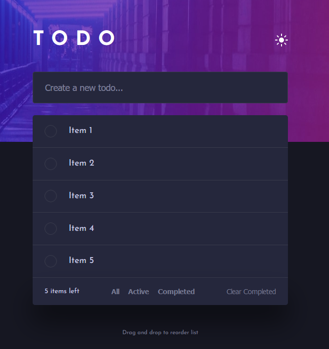

Todo App
======================================================
This is a solution to the [Todo-app challenge on Frontend Mentor](https://www.frontendmentor.io/solutions/todoapp-EqWzvAhIWX)

Todo App allows you to add, delete and reorder tasks with drag and drop functionality. The tasks are displayed in a list format and can be marked as completed or incomplete.  

Screenshot
------------

Installation
------------
To use this app, clone this repository to your local machine and then run the following commands:
`npm install
npm start`
This will install all the necessary dependencies and start the app.

Usage
-----
To add a new task, simply enter the task name in the input field and press enter. To delete a task, click on the "X" icon next to the task. To mark a task as complete, click on the checkbox next to the task.

Technology Stack
----------------
This app was built using the following technologies:
-   React
-   JavaScript
-   SCSS
-   HTML

License
-------
This project is licensed under the MIT License - see the [LICENSE](https://chat.openai.com/LICENSE) file for details.

Author
------
- LinkedIn - [https://www.linkedin.com/in/jordan-phillips-/]
- Frontend Mentor - [https://www.frontendmentor.io/profile/JordanPhillips-hub]
